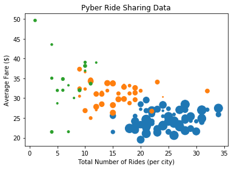
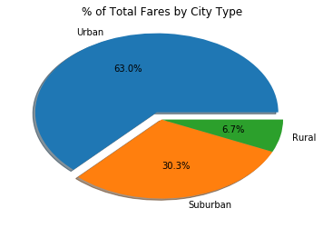
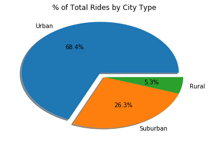
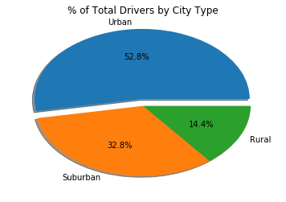

```python
import pandas as pd
import matplotlib.pyplot as plt
```


```python
df_city = pd.read_csv('raw_data/city_data.csv')
df_ride = pd.read_csv('raw_data/ride_data.csv')

df = df_ride.merge(df_city, on='city')

df_urban = df[df['type'] == 'Urban']
df_suburban = df[df['type'] == 'Suburban']
df_rural = df[df['type'] == 'Rural']

group_urban = df_urban.groupby(by='city')
df_temp1 = group_urban['fare'].mean().to_frame()
df_temp2 = group_urban['city'].count().to_frame()
df_temp2 = df_temp2.rename(columns={'city': 'rides'})
bubble_urban = df_temp1.merge(df_temp2, left_index=True, right_index=True)
bubble_urban = bubble_urban.merge(df_city[['city','driver_count']], left_index=True, right_on='city')
bubble_urban

group_suburban = df_suburban.groupby(by='city')
df_temp3 = group_suburban['fare'].mean().to_frame()
df_temp4 = group_suburban['city'].count().to_frame()
df_temp4 = df_temp4.rename(columns={'city': 'rides'})
bubble_suburban = df_temp3.merge(df_temp4, left_index=True, right_index=True)
bubble_suburban = bubble_suburban.merge(df_city[['city','driver_count']], left_index=True, right_on='city')
bubble_suburban

group_rural = df_rural.groupby(by='city')
df_temp5 = group_rural['fare'].mean().to_frame()
df_temp6 = group_rural['city'].count().to_frame()
df_temp6 = df_temp6.rename(columns={'city': 'rides'})
bubble_rural = df_temp5.merge(df_temp6, left_index=True, right_index=True)
bubble_rural = bubble_rural.merge(df_city[['city','driver_count']], left_index=True, right_on='city')
bubble_rural

plt.scatter(bubble_urban['rides'], bubble_urban['fare'], s=bubble_urban['driver_count']*3)
plt.scatter(bubble_suburban['rides'], bubble_suburban['fare'], s=bubble_suburban['driver_count']*3)
plt.scatter(bubble_rural['rides'], bubble_rural['fare'], s=bubble_rural['driver_count']*3)
plt.xlabel('Total Number of Rides (per city)')
plt.ylabel('Average Fare ($)')
plt.title('Pyber Ride Sharing Data')

plt.show()
```





```python
pie1 = [df_urban['fare'].sum(), df_suburban['fare'].sum(), df_rural['fare'].sum()]
plt.pie(pie1, shadow=True, explode=[0.1,0,0], autopct="%1.1f%%", labels=["Urban", "Suburban", "Rural"])
plt.title('% of Total Fares by City Type')
plt.show()
```





```python
pie2 = [df_urban['fare'].count(), df_suburban['fare'].count(), df_rural['fare'].count()]
plt.pie(pie2, shadow=True, explode=[0.1,0,0], autopct="%1.1f%%", labels=["Urban", "Suburban", "Rural"])
plt.title('% of Total Rides by City Type')
plt.show()
```





```python
pie3 = [df_city[df_city['type'] == 'Urban'].count()[0], df_city[df_city['type'] == 'Suburban'].count()[0], df_city[df_city['type'] == 'Rural'].count()[0]]
plt.pie(pie3, shadow=True, explode=[0.1,0,0], autopct="%1.1f%%", labels=["Urban", "Suburban", "Rural"])
plt.title('% of Total Drivers by City Type')
plt.show()
```




